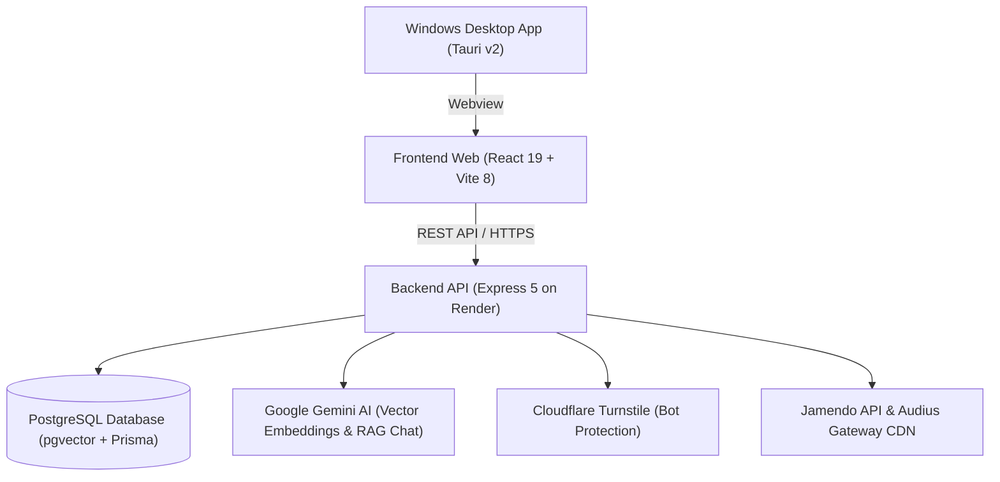

# JamWave — Indie Music Streaming & AI Discovery Platform 📼🎵

[](https://jam-wave.vercel.app)
[](https://github.com/minhthien435/JamWave/releases)
[](https://spotify-clone-0yaw.onrender.com/api/health)


-24C8D8?style=flat-square&logo=tauri&logoColor=white)


---

## 🌟 Overview

**JamWave** is an independent music streaming and AI-powered discovery platform inspired by the tactile, warm aesthetics of **vintage cassette tapes and indie zines**:

* 🎶 **Extensive Indie Music Catalog**: Over **2,440+ tracks** and **1,400+ albums** sourced legally from 2 independent music platforms:
  * **Jamendo**: 1,500+ tracks licensed under Creative Commons.
  * **Audius**: 940+ decentralized indie tracks streamed directly through active decentralized nodes.
* 🤖 **AI Semantic Search & Vector Discovery**: Natural language search powered by **Google Gemini 3072-dimensional embeddings** and **PostgreSQL `pgvector`** cosine similarity matching.
* ⚡ **High-Speed Parallel Downloader**: Fast multi-threaded track and playlist ZIP downloader with a real-time progress modal (speed in MB/s, ETA countdown, downloaded bytes, and percentage).
* 🖥️ **Native Windows Desktop Application**: Packaged using **Tauri v2** into lightweight Windows installers (`.msi` / `.exe`), featuring live automatic synchronization with web releases.
* 🔒 **Enterprise-Grade Security & Authentication**: Google OAuth 2.0, JWT authentication, Cloudflare Turnstile bot protection, and email OTP verification.

---

## 🎨 Design Philosophy (Indie Retro Zine Aesthetics)

The application embraces a warm, tactile, handcrafted physical media aesthetic:
* **Curated Color Palette**:
  * 🌰 Deep Espresso Brown: `#2E2721` / `#26211C` (Panels & Surfaces)
  * 🏺 Terracotta Copper: `#D97C54` / `#B85C38` (Brand Accents & Active Controls)
  * 📜 Vintage Paper Cream: `#EDE6D6` / `#A39282` (Typography & Outlines)
  * 🌿 Muted Sage Green: `#76876F` / `#5C6E56` (Verified Badges & Status)
* **Visual Elements**: Handcrafted dashed borders (`border-dashed-indie`), washi tape stickers, cassette tape brand iconography, rotating vinyl animations, and subtle glassmorphic overlays.

---

## 🚀 Architecture & Tech Stack



| Layer | Technologies | Role & Implementation |
|---|---|---|
| **Frontend Web** | React 19, Vite 8, Tailwind CSS 3, Zustand, Phosphor Icons | Fast client-side SPA, global audio state, playlist manager, responsive design |
| **Desktop App** | Tauri v2 (Rust + Windows WebView2) | Ultra-lightweight native Windows app (<10MB installer, ~30MB RAM), auto-updates |
| **Backend API** | Node.js 20, Express 5, Prisma ORM 5 | RESTful architecture, IPv4 audio streaming, parallel ZIP packaging, rate limiting |
| **Database** | PostgreSQL (Neon / Supabase) with `pgvector` | Users, playlists, tracks, listening history, and 3072-dimensional vector embeddings |
| **AI Intelligence** | Google Gemini Embeddings & RAG Chat | Vector cosine semantic search, natural language music recommendation engine |
| **Security** | JWT, Cloudflare Turnstile, bcryptjs, Nodemailer | Brute-force protection, OTP email verification, Google OAuth 2.0 |

---

## ✨ Key Features

### 1. Full Audio Player & Listening Stats
- Seamless audio streaming with queue management, shuffle, repeat, and volume control.
- Auto-skip error recovery for broken audio streams.
- Personal listening history tracking with total listening time calculations.

### 2. AI Semantic Search & Interactive Notebook
- Search songs by mood, vibe, or context (e.g., *"late night coding lo-fi"*, *"melancholy acoustic guitar"*).
- Powered by `pgvector` cosine similarity over Gemini 3072-dimensional embeddings.
- Interactive AI discovery notebook at `/docs`.

### 3. Parallel Downloader & Real-Time Progress Modal
- Single track MP3 download with embedded ID3 metadata.
- **Full Playlist ZIP Download**: High-concurrency parallel downloading (`concurrency = 2`) with IPv4 enforcement.
- **Real-time Modal**: Live download speed (`MB/s`), downloaded/total size (`MB`), percentage (`%`), ETA countdown, and safe abort via `AbortController`.

### 4. Playlists & Library Management
- Create, rename, and delete playlists with custom Indie confirmation dialogs.
- Custom playlist cover art and user profile avatar uploads.
- Public/Private playlist visibility toggling with shareable URLs.

### 5. Admin Management Dashboard
- Automated admin promotion based on the `ADMIN_EMAIL` environment variable.
- Dedicated Admin navigation link in the top bar and left sidebar.
- Comprehensive platform statistics (total users, tracks, listens, albums).
- User role management and track moderation.

---

## 💻 Local Development Setup

### Prerequisites
* **Node.js**: v18.x or v20.x+
* **PostgreSQL**: PostgreSQL database instance with the `vector` extension enabled.
* **Rust**: Required only if compiling the Tauri desktop app locally on Windows.

---

### 1. Backend Setup

```bash
cd backend
npm install

# Create environment configuration
cp .env.example .env

# Apply database schema
npx prisma db push

# Start development server on port 5000
npm run dev
```

### 2. Frontend Setup

```bash
cd frontend
npm install

# Start Vite development server on port 5173
npm run dev
```

Visit `http://localhost:5173` in your browser.

---

### 3. Windows Desktop App (Tauri Development)

```bash
cd frontend
npm run tauri dev
```

---

## ⚙️ Environment Variables Reference

### Backend (`backend/.env`)

| Variable | Description | Required |
|---|---|---|
| `DATABASE_URL` | PostgreSQL connection string with pgvector | **Yes** |
| `JWT_SECRET` | Secret key for signing and verifying JWT tokens | **Yes** |
| `PORT` | Backend server port (Default: `5000`) | No |
| `CLIENT_ORIGIN` | Allowed CORS origins (e.g., `https://jam-wave.vercel.app`) | No |
| `ADMIN_EMAIL` | Email address automatically granted `ADMIN` privileges | No |
| `TURNSTILE_SECRET_KEY` | Cloudflare Turnstile secret key | No |
| `GOOGLE_CLIENT_ID` | Google OAuth 2.0 Client ID | No |
| `AI_API_KEY` | Google Gemini API key for semantic embeddings and chat | No |
| `JAMENDO_CLIENT_ID` | Jamendo API Client ID for catalog metadata & artist artwork | No |

### Frontend (`frontend/.env` & Vercel)

| Variable | Description | Default |
|---|---|---|
| `VITE_API_URL` | Backend REST API base endpoint (e.g., `https://spotify-clone-0yaw.onrender.com/api`) | `/api` |
| `VITE_TURNSTILE_SITE_KEY` | Public Cloudflare Turnstile Site Key | — |
| `VITE_GOOGLE_CLIENT_ID` | Public Google OAuth 2.0 Client ID | — |

---

## 🪟 Windows Desktop App Build & CI/CD

The repository includes an automated **GitHub Actions CI/CD workflow** configured specifically for **Windows**:

1. Navigate to the **Actions** tab on your GitHub repository.
2. Select the **"Build Tauri Desktop App"** workflow and click **Run workflow**.
3. Once the build completes, download the generated Windows installers from **Releases / Artifacts**:
   * **`JamWave_x64_en-US.msi`** (Standard Windows Installer)
   * **`JamWave_x64.exe`** (Standalone Executable)

---

## 📄 License

This project is licensed under the **ISC License**. Music tracks and media assets remain the property of their respective independent artists and creators under **Creative Commons (Jamendo)** and **Decentralized Streaming (Audius)**.
